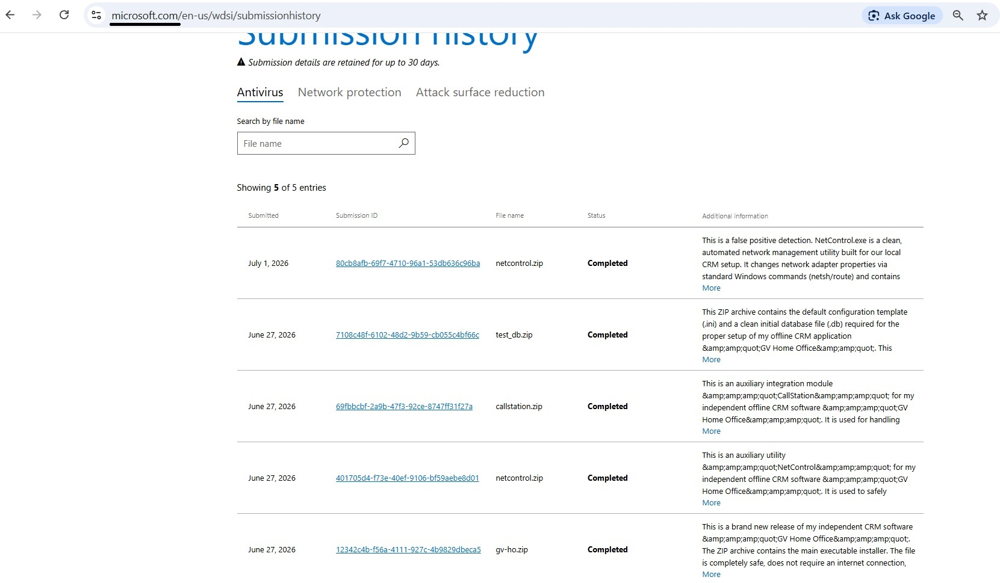
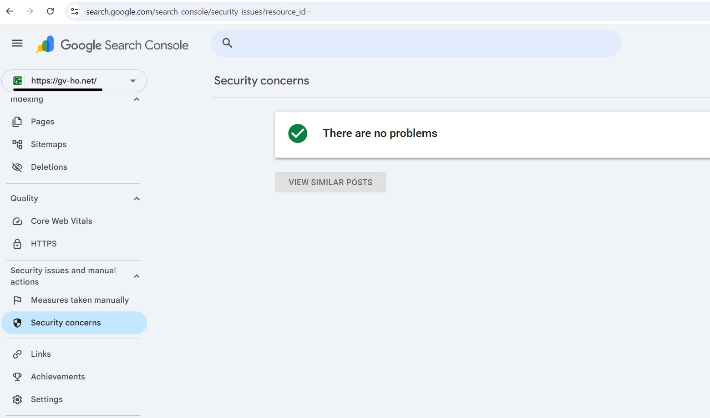

# GV Home Office
**Your Private Offline CRM System**

GV Home Office is a fully functional CRM system for small businesses that runs **completely locally**. No cloud servers, no internet dependency, and no subscriptions. You retain 100% ownership of your data.

## 🚀 Why GV Home Office?
* **Full Data Privacy:** All data is stored exclusively on your device.
* **Work Anywhere:** The system works without an internet connection. Just your PC, router, and local network.
* **100% Free:** No subscriptions, no ads, and no hidden fees.

## 🛡️ Security & Trust
Security is our top priority. The software is designed to operate in an isolated environment.
* **Verified:** GV Home Office has been scanned and cleared by Microsoft and Google security systems:

## 📥 Download CRM
Download the necessary components for GV Home Office:

* **[Full CRM System](ЗДЕСЬ_ССЫЛКА_НА_GV-HO.zip)**
* **[Network Control Module](ЗДЕСЬ_ССЫЛКА_НА_NetControl.zip)**
* **[Test Database](ЗДЕСЬ_ССЫЛКА_НА_Test_DB.zip)**
* **[Call Station App (APK)](https://github.com/gvhomeoffice77-CRM/GV-Home-Office/releases/download/v1.0.1/callstation.apk)**

## 🎥 Video Tutorials
Need help getting started? Watch our tutorials to set up your system:
**[Watch Video Tutorials on YouTube](https://www.youtube.com/playlist?list=PLkjRIF6weJT5PeD8cEXrqi6wqNeEQtR_8)**
*(Tip: Enable CC/Subtitles in your settings for translation).*

---

## ⚖️ License
**Copyright © 2026 Vadim. All rights reserved.**
This software is proprietary. You are not allowed to distribute, modify, or use the source code for commercial purposes without explicit permission from the author.
